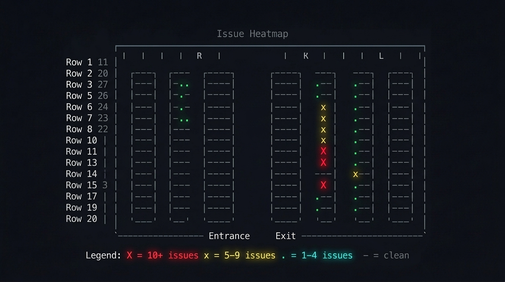

<div align="center">
  
  <p><strong>Find any rack on the floor. From your terminal.</strong></p>
  <p>A <a href="https://docs.anthropic.com/en/docs/claude-code">Claude Code</a> skill for data center teams.</p>

  [](LICENSE)
  [](https://github.com/rpatino-cw/datahall-map/issues)
</div>

---

### Highlight

> *"where's rack 145?"*


### Route

> *"walk me to rack 85"*


### Trace

> *"show the connection between rack 45 and rack 200"*


### Heatmap

> *"which racks have the most issues?"*



---

## Get started

```bash
git clone https://github.com/rpatino-cw/datahall-map.git ~/.claude/skills/datahall-map
```

Claude walks you through setup on first use. No config needed upfront.

---

## Contributing

Fork, add your site to `sample-layouts.json`, PR. No hostnames or IPs — rack counts only.

[MIT](LICENSE)
