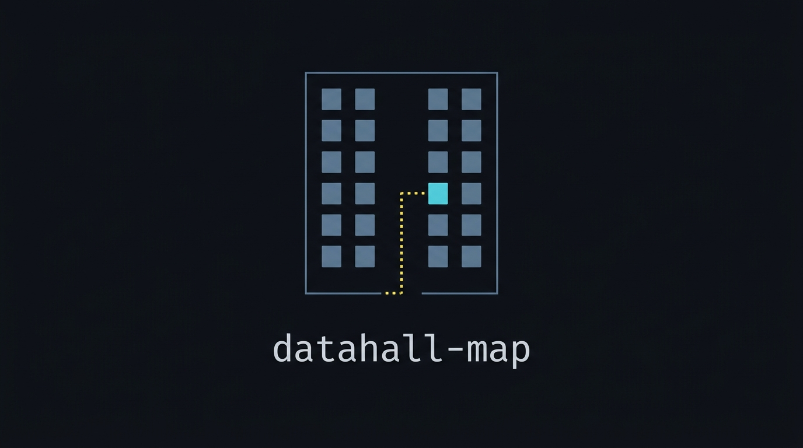
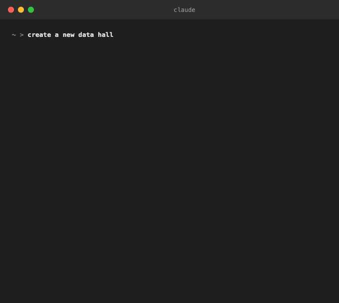
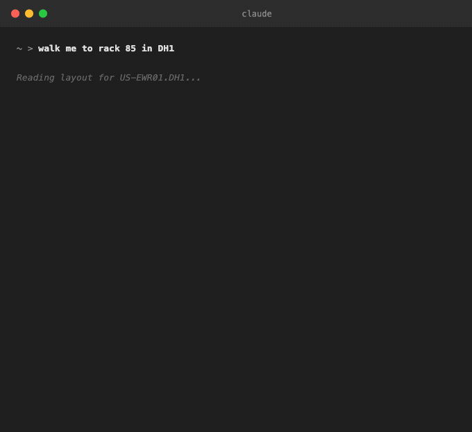
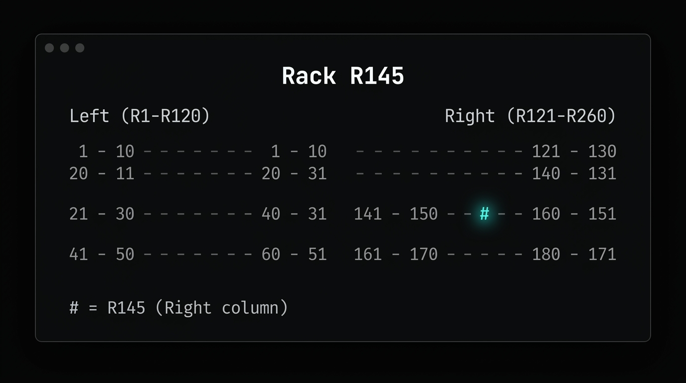
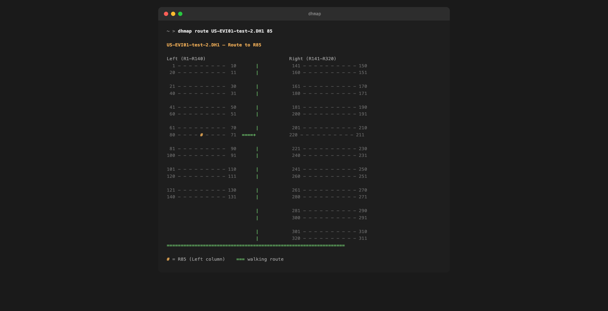
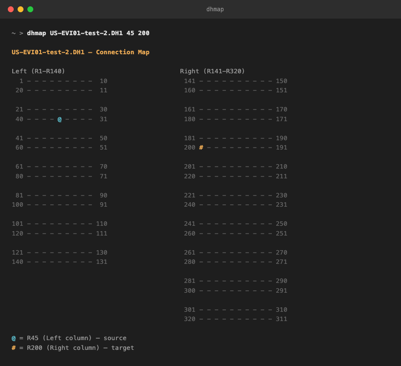

<div align="center">
  

  <br>

  **Your hall has 320 racks. Your team uses a spreadsheet.**

  Use this [Claude Code](https://docs.anthropic.com/en/docs/claude-code) skill to create ASCII data hall maps. Define your hall layout once -- it saves to a simple JSON file -- then ask where a rack is. Get a map. Walk to it.

  [](LICENSE)
  [](https://github.com/rpatino-cw/datahall-map/issues)
</div>

---

## Install

```bash
git clone https://github.com/rpatino-cw/datahall-map.git ~/.claude/skills/datahall-map
```

That's it. Open Claude Code and start asking.

---

## Define your hall

First time? Run `/datahall-map-creator` and Claude walks you through a wizard. Answer 9 questions, get a layout.



Or skip the wizard entirely:

> *"Create a hall: US-EWR01.DH1, serpentine, 10/row, Left R1-140, Right R141-320, entrance bottom-right"*

Your layout saves to `~/.datahall/layouts.json` -- a single JSON file with rack counts, column groups, numbering style, and entrance position. No database, no server. Add as many halls as you need.

---

## Use it

Invoke the skill with `/datahall-map`, then tell it what you need:

```
/datahall-map where is rack 145
/datahall-map walk me to rack 85 in DH1
/datahall-map show the connection between rack 45 and rack 200
```



Or just describe what you want -- Claude figures out the mode:

```
/datahall-map find R200
/datahall-map route to rack 45
/datahall-map trace R80 to R220
```

---

## Three modes

### Highlight &mdash; *"where's rack 145?"*



### Route &mdash; *"walk me to rack 85"*



### Trace &mdash; *"show the connection between rack 45 and rack 200"*



---

## Why this exists

Every data center team has the same problem: someone new walks onto the floor and has no idea where anything is. The rack numbering is serpentine, the columns are asymmetric, and the only "map" is a whiteboard photo from 2019.

This skill encodes your hall layout once and generates maps on demand. No app to install. No browser to open. Just ask Claude.

---

## What it supports

- **Serpentine or sequential** rack numbering
- **Any number of columns** (2-column left/right, 3-column A/B/C, whatever your hall uses)
- **Mixed racks-per-row** (10 on the left, 5 on the right? Fine.)
- **Walking routes** from any entrance position (bottom-right, bottom-left, top-right, top-left)
- **Connection maps** between any two racks (cable traces, IB links, cross-connects)
- **Multiple halls** in one config file

---

## Contributing

Fork, add your site to `sample-layouts.json`, PR. No hostnames or IPs -- rack counts only.

[MIT](LICENSE)
